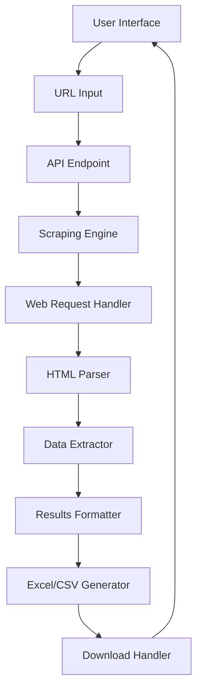

# Web Scraper Application Plan: Email Harvester

## 1. Architecture Overview

## 2. Technical Stack

- **Frontend**: Next.js with React
- **Scraping Technologies**:
  - Puppeteer (for JavaScript-heavy websites that require browser rendering)
  - Cheerio (for simpler static HTML parsing)
- **Data Processing**:
  - Regular expressions for email extraction
  - DOM traversal for structured data
- **Output Generation**:
  - ExcelJS for Excel file creation
  - CSV-stringify for CSV option

## 3. Core Components

### 3.1 User Interface

- Clean, professional single-page design
- URL input field with validation
- Submit button with loading state
- Results display area with preview of found emails
- Download button for exporting results

### 3.2 Scraping Engine

- **URL Validator/Normalizer**: Ensure URLs are properly formatted
- **Request Handler**: Handle HTTP requests with proper headers and timeout
- **Page Renderer**: Use Puppeteer for JavaScript-rendered content when needed
- **Content Parser**: Extract HTML content for analysis
- **Email Extractor**: Advanced regex patterns to find emails in text and HTML attributes
- **Contact Info Extractor**: Extract names and other useful marketing information
- **Rate Limiter**: Prevent overloading target websites

### 3.3 Data Processing

- Duplicate removal
- Validation of extracted emails
- Associating emails with names or other context when possible
- Structuring data for export

### 3.4 Export Module

- Excel file generation with formatted columns
- CSV alternative option
- Proper file naming with timestamp

## 4. Implementation Strategy

### Phase 1: Project Setup and Basic UI

1. Initialize Next.js project with TypeScript
2. Create basic UI components
3. Set up project structure and organization
4. Implement form validation for URL input

### Phase 2: Core Scraping Functionality

1. Implement API route for handling scrape requests
2. Create scraping logic with Cheerio for basic HTML extraction
3. Add Puppeteer integration for dynamic sites
4. Develop robust email and contact extraction patterns
5. Implement error handling and timeout mechanisms

### Phase 3: Results and Export Features

1. Develop results display component
2. Create Excel/CSV generation functionality
3. Implement download mechanism
4. Add loading states and error messages

### Phase 4: Testing and Optimization

1. Test against various website types
2. Optimize scraping speed and reliability
3. Improve extraction patterns based on test results
4. Enhance error handling

## 5. Advanced Features (If Time Permits)

- **Smart Crawling**: Follow internal links to find more contact pages
- **Proxy Support**: Rotate IP addresses to avoid blocking
- **Contact Page Detection**: Smart detection of "Contact Us" or similar pages
- **Data Enrichment**: Match emails with corresponding titles/positions when available

## 6. Challenges and Mitigations

### Challenges:

1. **Anti-Scraping Measures**: Many websites implement protections against scraping
2. **Dynamic Content**: JavaScript-rendered content may not be accessible with simple HTTP requests
3. **Diverse HTML Structures**: Each website may organize contact information differently
4. **Rate Limiting**: Too many requests can get IP blocked

### Mitigations:

1. Use browser-like headers and respect robots.txt
2. Implement Puppeteer for JavaScript-heavy sites
3. Create flexible extraction patterns that work across different HTML structures
4. Add delays between requests and limit concurrent scraping

### END
